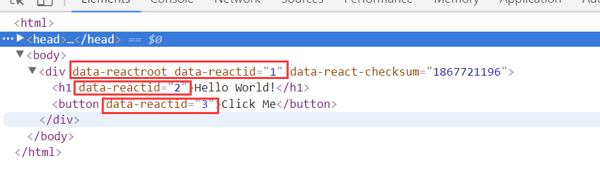
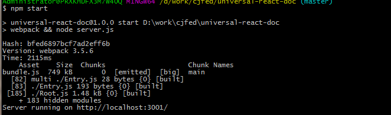
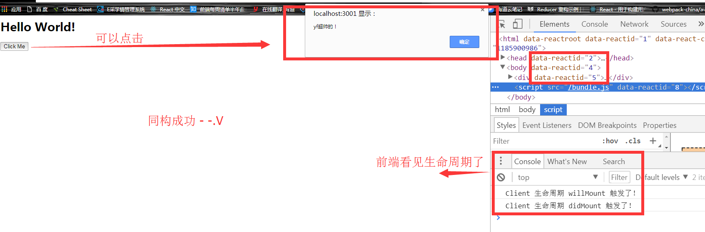
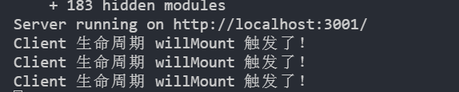
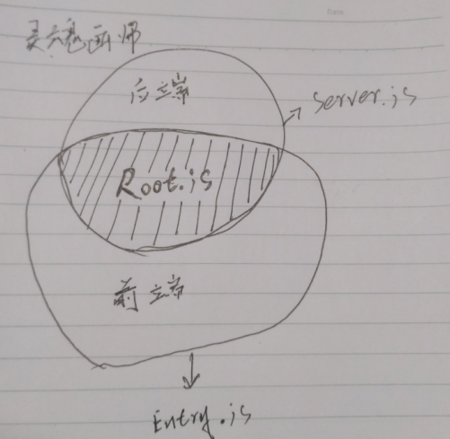

# react服务端渲染的实现思路
## Step1: 利用 NodeJs + Express 搭建入门级的react服务端渲染
>Express 是为了更方便的搭建HTTP服务器
* 依赖需求
- [nodeJs @8+](http://nodejs.cn/)
- [expressJs @4+](http://www.expressjs.com.cn/) `最好全局安装下`
- react 15+
- react-dom 15+
- babel-preset-react
- babel-preset-es2015
- babel-register
- babel-loader
- [webpack @2+](https://doc.webpack-china.org/)


### 建一个server.js目录，利用 Express 起一个HTTP
>npm init -y<br />
>yarn add express 或者 npm install express --save<br />
>创建文件server.js
```js
// server.js
const express = require('express');
const server = express();

server.get('/', (request, response) => {
    const html = `<h1>universal - react<h1>`;
    response.send(html);
});

// 服务器端口
const port = 3001;

server.listen(port, (err) => {
    if (err) {
        console.error(err);
        return;
    }
    console.info(`Server running on http://localhost:${port}/`);
});
``` 
```
启动这个服务
node server.js
控制台可以看到
$ node server.js
Server running on http://localhost:3001/
打开网页就看到 universal - react
```
`如果报express没有发现，全局安装express即可`<br />
### 加入react
>yarn add react react-dom 或者 npm install react react-dom --save<br />
>创建 Root.js文件<br />
```js
// Root.js
const React = require('react');
// import React, { Component } from 'react';

class Root extends React.Component {
    constructor (props) {
        super(props);
        this._handleClick = this._handleClick.bind(this);
    }
    componentWillMount () {
        console.log('root 生命周期 willMount 触发了！');
    }
    componentDidMount () {
        console.log('root 生命周期 didMount 触发了！');
    }
    _handleClick () {
        alert('yf超帅的！');
    }
    render() {
        return (<div>
                <h1>Hello World!</h1>
                <button onClick={this._handleClick}>Click Me</button>
            </div>);
    }
}

module.exports = Root;
// export default Root;
```
>修改server.js文件
```js
// server.js
const express = require('express');
// 加入的
const Root = require('./Root.js');
const React = require('react');
const ReactDOMServer = require('react-dom/server');

const Server = express();

Server.get('/', function (request, response) {
    // 变动的
    const html = ReactDOMServer.renderToString(
        React.createElement(Root)
    );
    response.send(html);
});

// 服务器端口
const port = 3001;

Server.listen(port, (err) => {
    if (err) {
        console.error(err);
        return;
    }
    console.info(`Server running on http://localhost:${port}/`);
});
```
>node server.js 启动， 你就会惊喜地发现，控制台报错了 - - <br />
>出现这个问题是因为服务端不识别ReactJs，所以我们要安装以下插件；<br />
>yarn add babel-preset-react babel-register 或者 npm install babel-preset-react babel-register --save<br />
>然后从server.js的头部插入以下代码
```js
// server.js
require('babel-register')({
    presets: ['react']
});
```
>node server.js 启动，打开网页 http://localhost:3001/  正常了！ <br />
>打开firebug会看到，元素上出现data-reactid的属性，这是 renderToString 这个方法产生的！还有另外一个也是服务端渲染的方法 renderToStaticMarkup, 不过他们之间差异，我也不清楚，自行百度吧！
<p align="center">
    
</p>

这时候点击按钮，发现什么都没发生; 而且控制台也只出现`willMount`没有出现`didMount`, 这是因为 ReactDOMServer 只是像字符串一样渲染出 html，换句话说只是在服务端渲染了，客户端还没有`接管代码`，这时候还不算是同构；
>为了达到同构的效果，我们需要加入/修改一些文件<br />
>修改 Root.js 把render return 里面的 节点 替换成 html 的形式
```js
// Root.js
// ...
render() {
    return (
        <html>
            <head>
                <title>Universal React</title>
            </head>
            <body>
                <div>
                    <h1>Hello World!</h1>
                    <button onClick={this._handleClick}>Click Me</button>
                </div>
                {/* 
                因为会渲染成react的格式，所以<script></script>可以写成<script /> 
                */}
                <script src='/bundle.js' />
            </body>
        </html>
    );
}
```
- 新增 public 文件夹，用于存放静态文件 <br />
>mkdir public
- 新增 Entry.js 文件, 用于处理 `服务端渲染时，前端的同构`
>touch Entry.js
```js
// Entry.js
const React = require('react');
const ReactDOM = require('react-dom');
const Root = require('./Root.js');

ReactDOM.render(
    React.createElement(Root),
    // document 可以理解为浏览器
    document
);
```
- 安装 babel-loader webpack 依赖
>yarn add webpack babel-loader babel-preset-es2015 或者 npm install webpack babel-loader babel-preset-es2015 --save
- 新增 webpack.config.js 文件
>touch webpack.config.js<br />
>本文主要是讲解服务端渲染，webpack详细的配置问题这边不做详细讲解
```js
// webpack.config.js
const path = require('path');
const webpack = require('webpack');
module.exports = {
    entry: ['./Entry.js'],
    output: {
        filename: 'bundle.js',
        path: path.join(__dirname, 'public'),
    },
    module: {
        loaders: [
            {
                test: /\.js|x?$/,
                exclude: /node_modules/,
                loader: 'babel-loader',
                query: {
                    presets: ['react', 'es2015']
                }
            }
        ]
    }
};
```
- 修改server.js,加入托管静态文件的功能
```js
// ...
// 托管静态文件
Server.use(express.static('public'));
// ...
```
- 修改package.json 的 "scripts"
```js
"scripts": {
    "start": "webpack && node server.js"
},
```
>npm start 重启服务器,看到控制台出现一下代码
<p align="center">
    
</p>

>打开网页 http://localhost:3001/ 可以看到按钮可以点击，还弹出来很符合实际的对话框，网页的console也出现生命周期里的console.log<br />
<p align="center">
    
</p>

* 为了可以更好的理解同构，大家可以刷新多几遍 网页 http://localhost:3001/ 然后对比一下 `后端控制台` 与 `前端控制台`

<p align="center">
    
</p>
<p align="center">
    
</p>
<p align="center">
    
</p>

* 这就是同构——`后台与前端同时渲染`Root.js

### Root.js使用ES6语法----import/export (了解一下即可)
>细心的人会发现，我们在服务端与客户端同时运行的文件Root.js,里面的导入/导出是使用CommonJs的语法，并不是ES6的import/export语法,原因是服务端并没有经过webpack处理，服务端还是NodeJs的地盘，`NodeJs是支持CommonJs，但仅支持部分ES6语法的`,为了让服务端支持ES6语法的import/export,我们只要稍微修改下server.js即可！
```js
// server.js
require('babel-register')({
    // presets: ['react']
    presets: ['react', 'es2015']
});
// ...
```
>对，就是把babel-preset-es2015这个插件引入到这里就可以了！<br />
>然后我们修改一下Root.js与server.js
```js
// Root.js

// const React = require('react');
import React from 'react';

//...

// module.exports = Root;
export default Root;
```
>因为换成了 ES6 的export default,所以server.js里的也要相应的修改;<br />
>CommonJS ES6 AMD等的导入导出之间的关系，网上一搜一堆，这边不做细说;
```js
// const Root = require('./Root.js');
const Root = require('./Root.js').default;
```
>因为Entry.js是经过了webpack处理，webpack是默认支持CommonJS,再加上module里配置了支持ES6,所以Entry.js使用CommonJS语法或者ES6语法都是没问题的，有兴趣的可以自行去修改为ES6的import语法;

* 到这里 Step1 入门级的同构完成，但离实际开发还有很大一段距离，接下来的 Step2 会是`前端路由`在服务端渲染中的应用

## Step2: 前端路由在服务端渲染中的应用
>react社区的路由框架有好几种，其中最有名的就是react-router了！本次也是在react-router @3 版本基础上进行服务端渲染;
- 依赖需求
- [react-router @3](https://github.com/ReactTraining/react-router/tree/v3/docs)

>安装react-router @3<br />
>yarn add react-router@3 或者 npm install react-router@3 --save<br />
>mkdir routes 新建立routes文件夹,touch index.js 在routes里建立index.js,把server.js的路由代码移到index.js中<br />
```js
// server.js

// const Root = require('./Root.js').default;
// const React = require('react');
// const ReactDOMServer = require('react-dom/server');
// Server.get('/', function (request, response) {
//     const html = ReactDOMServer.renderToString(
//         React.createElement(Root)
//     );
//     response.send(html);
// });

// 使用路由
Server.use(require('./routes'));
```
```js
// routes/index.js
// 正常使用 ES6 语法
import express from 'express';
const router = express.Router();
// const router = require('express').Router();
import Root from '../Root';
// const Root = require('../Root.js').default;
import React from 'react';
// const React = require('react');
import {
    renderToString
} from 'react-dom/server';
// const ReactDOMServer = require('react-dom/server');

router.get('/', function (request, response) {
    const html = renderToString(
        React.createElement(Root)
    );
    response.send(html);
});

module.exports = router;
```
>npm start 打开网页 http://localhost:3001/, 正常！

* 根据[router-router@3的服务端渲染文档](https://github.com/ReactTraining/react-router/blob/v3/docs/guides/ServerRendering.md),继续修改routes/index.js文件
```js
// routes/index.js
import express from 'express';
import React from 'react';
import {
    renderToString
} from 'react-dom/server';
import Root from '../Root';
import {
    match, RouterContext
} from 'react-router';
import routes from './configureRoute';
const router = express.Router();


router.get('*', function (req, res) {
    // Note that req.url here should be the full URL path from
    // the original request, including the query string.
    match(
        {routes, location: req.url},
        (error, redirectLocation, renderProps) => {
            if (error) {
                res.status(500).send(error.message)
            } else if (redirectLocation) {
                res.redirect(302, redirectLocation.pathname + redirectLocation.search)
            } else if (renderProps) {
                // You can also check renderProps.components or renderProps.routes for
                // your "not found" component or route respectively, and send a 404 as
                // below, if you're using a catch-all route.
                const html = renderToString(
                    <RouterContext
                        {...renderProps}

                    />
                )
                res.status(200).send(html)
            } else {
                res.status(404).send('Not found')
            }
        }
    )
});

module.exports = router;
```
>touch configureRoute.js 在routes中新建一个 configureRoute.js 文件
```js
import React from 'react';
import {
    Router, Route, browserHistory
} from 'react-router';
import Root from '../Root';

export default (
    <Router history={browserHistory}>
        <Route path='/' component={Root}>
        </Route>
    </Router>
)
```
>修改Entry.js文件
```js
// Entry.js
// import React from 'react';
import ReactDOM from 'react-dom';
// import Root from './Root';
import routes from './routes/configureRoute';

ReactDOM.render(
    routes,
    // React.createElement(Root),
    // document 可以理解为浏览器
    document
);
```
>npm start 打开网页 http://localhost:3001/, 显示正常 

