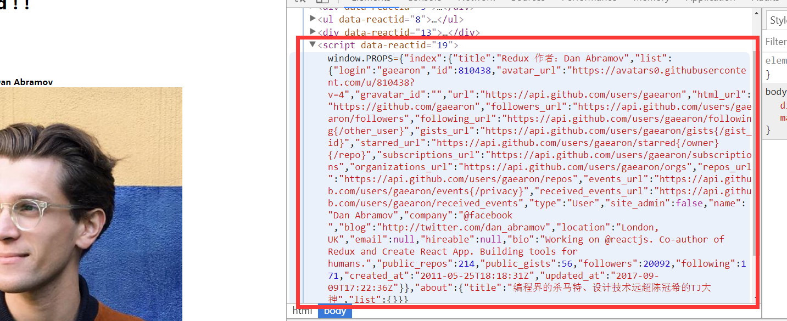

## ⚠️⚠️⚠️ This Is Experimental and Incomplete! ⚠️⚠️⚠️
* 这并不是一个可以拿来当脚手架的项目，只是为了让大家对react同构（服务端渲染）有个更加直观的认识！

>下载项目
* git clone https://github.com/yellowfrogCN/universal-react-doc.git
>安装<br />
* yarn install 或者 npm install<br />
>运行<br />
* yarn start 或者 npm start <br />
>打开网页<br />
* http://localhost:3001/

## 实现思路
- [Step1: 利用 NodeJs + Express 搭建入门级的react同构](#step1)
- [Step2: 前端路由在同构中的应用](#step2)
- [Step3: redux 的同构#1](#step3)
- [Step4: redux 的同构#2 ---- 服务端获取当页的异步数据](#step4)

## 参考
* 文本类
* [redux服务端渲染](http://cn.redux.js.org/docs/recipes/ServerRendering.html)
* [react-router @3](https://github.com/ReactTraining/react-router/tree/v3/docs)
* [简书上一篇不错的文章，基于KOA的](http://www.jianshu.com/p/0ecd727107bb)
* [universal-react-tutorial-video(需要翻墙)](https://www.youtube.com/watch?v=k66bOHX8MnY&list=PLVgOtoUBG2md5HxaABCcnfstF88CPzUeD&index=1)
* 脚手架
* [universal-react-tutorial(推荐，蛮多思路借鉴于这个)](https://github.com/remarkablemark/universal-react-tutorial)
* [react-redux-universal-hot-example(一万多star)](https://github.com/erikras/react-redux-universal-hot-example)
* [universal-react（服务端异步加载数据的思路借鉴于此）](https://github.com/DominicTobias/universal-react)
* [基于KOA2、react-router @4 的一个脚手架](https://github.com/kimjuny/koa-react-universal)

* 主要依赖需求
- [nodeJs @6+](http://nodejs.cn/)
- [expressJs @4+](http://www.expressjs.com.cn/) `最好全局安装下`
- react 15+
- react-dom 15+
- babel-preset-react
- babel-preset-es2015
- babel-register
- babel-loader
- [webpack @2+](https://doc.webpack-china.org/)
- [react-router @3](https://github.com/ReactTraining/react-router/tree/v3/docs)
- redux
- react-redux
- redux-thunk 
- redux-logger
- [nodemon](https://github.com/remy/nodemon) node服务器的升级版
- [npm-run-all](https://github.com/mysticatea/npm-run-all) 可以同时起多个服务

## <span id='step1'>Step1:利用 NodeJs + Express 搭建入门级的react同构</span>
>Express 是为了更方便的搭建HTTP服务器


### 建一个server.js目录，利用 Express 起一个HTTP
>npm init -y<br />
>yarn add express 或者 npm install express --save<br />
>创建文件server.js
```js
// server.js
const express = require('express');
const server = express();

server.get('/', (request, response) => {
    const html = `<h1>universal - react<h1>`;
    response.send(html);
});

// 服务器端口
const port = 3001;

server.listen(port, (err) => {
    if (err) {
        console.error(err);
        return;
    }
    console.info(`Server running on http://localhost:${port}/`);
});
``` 
```
启动这个服务
node server.js
控制台可以看到
$ node server.js
Server running on http://localhost:3001/
打开网页就看到 universal - react
```
`如果报express没有发现，全局安装express即可`<br />
### 加入react
>yarn add react react-dom 或者 npm install react react-dom --save<br />
>创建 Root.js文件<br />
```js
// Root.js
const React = require('react');
// import React, { Component } from 'react';

class Root extends React.Component {
    constructor (props) {
        super(props);
        this._handleClick = this._handleClick.bind(this);
    }
    componentWillMount () {
        console.log('root 生命周期 willMount 触发了！');
    }
    componentDidMount () {
        console.log('root 生命周期 didMount 触发了！');
    }
    _handleClick () {
        alert('yf超帅的！');
    }
    render() {
        return (<div>
                <h1>Hello World!</h1>
                <button onClick={this._handleClick}>Click Me</button>
            </div>);
    }
}

module.exports = Root;
// export default Root;
```
>修改server.js文件
```js
// server.js
const express = require('express');
// 加入的
const Root = require('./Root.js');
const React = require('react');
const ReactDOMServer = require('react-dom/server');

const Server = express();

Server.get('/', function (request, response) {
    // 变动的
    const html = ReactDOMServer.renderToString(
        React.createElement(Root)
    );
    response.send(html);
});

// 服务器端口
const port = 3001;

Server.listen(port, (err) => {
    if (err) {
        console.error(err);
        return;
    }
    console.info(`Server running on http://localhost:${port}/`);
});
```
>node server.js 启动， 你就会惊喜地发现，控制台报错了 - - <br />
>出现这个问题是因为服务端不识别ReactJs，所以我们要安装以下插件；<br />
>yarn add babel-preset-react babel-register 或者 npm install babel-preset-react babel-register --save<br />
>然后从server.js的头部插入以下代码
```js
// server.js
require('babel-register')({
    presets: ['react']
});
```
>node server.js 启动，打开网页 http://localhost:3001/  正常了！ <br />
>打开firebug会看到，元素上出现data-reactid的属性，这是 renderToString 这个方法产生的！还有另外一个方法 renderToStaticMarkup, 不过他们之间差异，我也不清楚，自行百度吧！
<p align="center">
    
</p>

这时候点击按钮，发现什么都没发生; 而且控制台也只出现`willMount`没有出现`didMount`, 这是因为 ReactDOMServer 只是像字符串一样渲染出 html，换句话说只是在服务端渲染了，前端还没有`接管代码`，这时候还不算是同构；
>为了达到同构的效果，我们需要加入/修改一些文件<br />
>修改 Root.js 把render return 里面的 节点 替换成 html 的形式
```js
// Root.js
// ...
render() {
    return (
        <html>
            <head>
                <title>Universal React</title>
            </head>
            <body>
                <div>
                    <h1>Hello World!</h1>
                    <button onClick={this._handleClick}>Click Me</button>
                </div>
                {/* 
                因为会渲染成react的格式，所以<script></script>可以写成<script /> 
                */}
                <script src='/bundle.js' />
            </body>
        </html>
    );
}
```
- 新增 public 文件夹，用于存放静态文件 <br />
>mkdir public
- 新增 Entry.js 文件, 用于处理 `服务端渲染时，前端的同构`
>touch Entry.js
```js
// Entry.js
const React = require('react');
const ReactDOM = require('react-dom');
const Root = require('./Root.js');

ReactDOM.render(
    React.createElement(Root),
    // document 可以理解为浏览器
    document
);
```
- 安装 babel-loader webpack 依赖
>yarn add webpack babel-loader babel-preset-es2015 或者 npm install webpack babel-loader babel-preset-es2015 --save
- 新增 webpack.config.js 文件
>touch webpack.config.js<br />
>本文主要是讲解同构，webpack详细的配置问题这边不做详细讲解
```js
// webpack.config.js
const path = require('path');
const webpack = require('webpack');
module.exports = {
    entry: ['./Entry.js'],
    output: {
        filename: 'bundle.js',
        path: path.join(__dirname, 'public'),
    },
    module: {
        loaders: [
            {
                test: /\.js|x?$/,
                exclude: /node_modules/,
                loader: 'babel-loader',
                query: {
                    presets: ['react', 'es2015']
                }
            }
        ]
    }
};
```
- 修改server.js,加入托管静态文件的功能
```js
// ...
// 托管静态文件
Server.use(express.static('public'));
// ...
```
- 修改package.json 的 "scripts"
```js
"scripts": {
    "start": "webpack && node server.js"
},
```
>npm start 重启服务器,看到控制台出现一下代码
<p align="center">
    
</p>

>打开网页 http://localhost:3001/ 可以看到按钮可以点击，还弹出来很符合实际的对话框，网页的console也出现生命周期里的console.log<br />
<p align="center">
    
</p>

* 为了可以更好的理解同构，大家可以刷新多几遍 网页 http://localhost:3001/ 然后对比一下 `后端控制台` 与 `前端控制台`

<p align="center">
    
</p>
<p align="center">
    
</p>
<p align="center">
    
</p>

* 这就是同构——`后台与前端同时渲染`Root.js

### Root.js使用ES6语法----import/export (了解一下即可)
>细心的人会发现，我们在服务端与前端同时运行的文件Root.js,里面的导入/导出是使用CommonJs的语法，并不是ES6的import/export语法,原因是服务端并没有经过webpack处理，服务端还是NodeJs的地盘，`NodeJs是支持CommonJs，但仅支持部分ES6语法的`,为了让服务端支持ES6语法的import/export,我们只要稍微修改下server.js即可！
```js
// server.js
require('babel-register')({
    // presets: ['react']
    presets: ['react', 'es2015']
});
// ...
```
>对，就是把babel-preset-es2015这个插件引入到这里就可以了！<br />
>然后我们修改一下Root.js与server.js
```js
// Root.js

// const React = require('react');
import React from 'react';

//...

// module.exports = Root;
export default Root;
```
>因为换成了 ES6 的export default,所以server.js里的也要相应的修改;<br />
>CommonJS ES6 AMD等的导入导出之间的关系，网上一搜一堆，这边不做细说;
```js
// const Root = require('./Root.js');
const Root = require('./Root.js').default;
```
>因为Entry.js是经过了webpack处理，webpack是默认支持CommonJS,再加上module里配置了支持ES6,所以Entry.js使用CommonJS语法或者ES6语法都是没问题的，有兴趣的可以自行去修改为ES6的import语法;

* 到这里 Step1 入门级的同构完成，但离实际开发还有很大一段距离，接下来的 Step2 会是`前端路由`在同构中的应用

## <span id="step2">Step2: 前端路由在同构中的应用</span>
>react社区的路由框架有好几种，其中最有名的就是react-router了！本次也是在react-router @3 版本基础上进行同构;
- 依赖需求
- [react-router @3](https://github.com/ReactTraining/react-router/tree/v3/docs)

>安装react-router @3<br />
>yarn add react-router@3 或者 npm install react-router@3 --save<br />
>mkdir routes 新建立routes文件夹,touch index.js 在routes里建立index.js,把server.js的路由代码移到index.js中<br />
```js
// server.js

// const Root = require('./Root.js').default;
// const React = require('react');
// const ReactDOMServer = require('react-dom/server');
// Server.get('/', function (request, response) {
//     const html = ReactDOMServer.renderToString(
//         React.createElement(Root)
//     );
//     response.send(html);
// });

// 使用路由
Server.use(require('./routes'));
```
```js
// routes/index.js
// 正常使用 ES6 语法
import express from 'express';
const router = express.Router();
// const router = require('express').Router();
import Root from '../Root';
// const Root = require('../Root.js').default;
import React from 'react';
// const React = require('react');
import {
    renderToString
} from 'react-dom/server';
// const ReactDOMServer = require('react-dom/server');

router.get('/', function (request, response) {
    const html = renderToString(
        React.createElement(Root)
    );
    response.send(html);
});

module.exports = router;
```
>npm start 打开网页 http://localhost:3001/, 正常！

* 根据[router-router@3的同构文档](https://github.com/ReactTraining/react-router/blob/v3/docs/guides/ServerRendering.md),继续修改routes/index.js文件
```js
// routes/index.js
import express from 'express';
import React from 'react';
import {
    renderToString
} from 'react-dom/server';
import Root from '../Root';
import {
    match, RouterContext
} from 'react-router';
import routes from './configureRoute';
const router = express.Router();


router.get('*', function (req, res) {
    // Note that req.url here should be the full URL path from
    // the original request, including the query string.
    match(
        {routes, location: req.url},
        (error, redirectLocation, renderProps) => {
            if (error) {
                res.status(500).send(error.message)
            } else if (redirectLocation) {
                res.redirect(302, redirectLocation.pathname + redirectLocation.search)
            } else if (renderProps) {
                // You can also check renderProps.components or renderProps.routes for
                // your "not found" component or route respectively, and send a 404 as
                // below, if you're using a catch-all route.
                const html = renderToString(
                    <RouterContext
                        {...renderProps}

                    />
                )
                res.status(200).send(html)
            } else {
                res.status(404).send('Not found')
            }
        }
    )
});

module.exports = router;
```
>touch configureRoute.js 在routes中新建一个 configureRoute.js 文件
```js
import React from 'react';
import {
    Router, Route, browserHistory
} from 'react-router';
import Root from '../Root';

export default (
    <Router history={browserHistory}>
        <Route path='/' component={Root}>
        </Route>
    </Router>
)
```
>修改Entry.js文件
```js
// Entry.js
// import React from 'react';
import ReactDOM from 'react-dom';
// import Root from './Root';
import routes from './routes/configureRoute';

ReactDOM.render(
    routes,
    // React.createElement(Root),
    // document 可以理解为浏览器
    document
);
```
>npm start 打开网页 http://localhost:3001/, 显示正常 
>现在我们加入静态路由，试验一下
```js
// Root.js
import { Link } from 'react-router';
// ...
<ul>
    <li>
        <Link to='/'>Index</Link>
    </li>
    <li>
        <Link to='/about'>About</Link>
    </li>
</ul>
{this.props.children}
// ...
```
>新增container，在container目录下新建Index.js/About.js
```js
// Index.js
import React, {Component} from 'react';

class Index extends Component {
    render () {
        return (
            <p>
                Current: <strong>Index</strong>
            </p>
        )
    }
}
export default Index;

// About.js
import React, {Component} from 'react';

class About extends Component {
    render () {
        return (
            <p>
                Current: <strong>About</strong>
            </p>
        )
    }
}
export default About;
```
>在configureRoute.js里引入Index.js与About.js路由
```js
// configureRoute.js

// ...
import Index from '../container/Index';
import About from '../container/About';

export default (
    <Router history={browserHistory}>
        <Route path='/' component={Root}>
            <IndexRoute component={Index} />
            <Route path='/about' component={About} />
        </Route>
    </Router>
)
```
>npm start 打开网页 http://localhost:3001/ ,点击 正常 ！
>我们在routes/index.js里面加上一个console.log('renderProps');
```js
// routes/index.js
// ...
console.log('renderProps');
// ...
```
>重启，打开网页，重点看`后台控制台`
<p align="center">
    
</p>

>我们发现，除非手动刷新页面，无论`前端路由`如何点击，renderProps都在只会出现`后台控制台`出现一次，说明，前端已经接管了路由，路由部分同构成功 - -.V

* 在刚才的灵魂画师的图，我们在加入路由部分，更方便理解路由部分的前后端同构；
<p align="center">
    
</p>

* 到这里，Step2：react-router的同构算是基本完成，后续会在此基础上加上动态路由等，但接下来的Step3,重点是 redux 的同构方案！

## <span id="step3">Step3: redux 的同构#1</span>
><font color=red>redux的同构，这边分成两步</font><br />
>第一步先把redux集成进同构中<br />
>第二步再在第一部的基础上，考虑在前端`接管页面`时，同时拿到页面的数据！也就是本页的异步请求，发生在服务端

* 安装依赖
* 小插曲，相信大家不断的npm start 已经烦死了吧！这边先用一个简单实用的方式来长时间启动服务器！
>yarn add npm-run-all nodemon --dev 或者 npm install npm-run-all nodemon --save-dev
>然后修改我们的 package.json 里的 srcipts
```js
"scripts": {
    "start": "npm-run-all --parallel watch:*",
    "watch:webpack": "webpack -w",
    "watch:server": "nodemon --ext js,jsx --ignore public/ server.js"
},
```
>以后只需要npm start 然后 F5 刷新就可以修改代码！（热更新后续加入）
* 加入redux
>yarn add redux redux-logger redux-thunk react-redux [redux-devtools-extension](https://github.com/yellowfrogCN/reduxDevTools) 或者 npm install redux redux-logger redux-thunk react-redux [redux-devtools-extension](https://github.com/yellowfrogCN/reduxDevTools) --save

>新建文件夹redux,在redux文件夹里建立configureStore.js与index.js<br />

```js
// configureStore.js
import { createStore, applyMiddleware } from 'redux';
import thunkMiddleware from 'redux-thunk';
import rootReducer from '../reducer';
import { createLogger } from 'redux-logger';
import { composeWithDevTools } from 'redux-devtools-extension';

const logger = createLogger({
  collapsed: true
})

const composeEnhancers = composeWithDevTools({
  // 后续如需配置参数，可在这里配置
});

const middleware = [thunkMiddleware, logger];

const configureStore = (preloadedState = {}) => {
    const store = createStore(
        rootReducer,
        preloadedState,
        composeEnhancers(
            applyMiddleware(...middleware)
        )
    );

    if (module.hot) {
        module.hot.accept('../reducer', () => {
            store.replaceReducer(rootReducer);
        });
    }

    return store;
}

export default configureStore;

```

```js
// redux/configureStore.js
import configureStore from './configureStore.dev';
export default configureStore;
```
>新建文件夹 contants/index 用于存放常量，主要是 action.type
```js
// contants/index
export const GET_DAN_INFO = 'GET_DAN_INFO';
export const GET_DAN_INFO_SUCCESS = 'GET_DAN_INFO_SUCCESS';
export const GET_DAN_INFO_FAILED = 'GET_DAN_INFO_FAILED';

export const GET_TJ_INFO = 'GET_TJ_INFO';
export const GET_TJ_INFO_SUCCESS = 'GET_TJ_INFO_SUCCESS';
export const GET_TJ_INFO_FAILED = 'GET_TJ_INFO_FAILED'; 
```
>新建文件夹 reducer,在 reducer 文件夹里分别建立 index.js aboutReducer.js（对应About组件的数据） indexReducer.js（对应Index组件的数据）<br />

```js
// reducer/indexReducer.js
import * as types from '../contants';

function indexReducer (
    state = {
        title: 'Redux 作者：Dan Abramov',
        list: {}
    },
    action
) {
    switch (action.type) {
        case types.GET_DAN_INFO_SUCCESS:
            return Object.assign({}, state, {
                list: action.payload
            })
        case types.GET_DAN_INFO_FAILED:
            return Object.assign({}, state, {
                list: {}
            }) 
        default:
            return state;
    }
}

export default indexReducer;
```
```js
// reducer/aboutReducer.js
// reducer/aboutReducer.js
import * as types from '../contants';
function aboutReducer (
    state = {
        title: '编程界的杀马特、设计技术远超陈冠希的TJ大神',
        list: {}
    },
    action
) {
    switch (action.type) {
        case types.GET_TJ_INFO_SUCCESS:
            return Object.assign({}, state, {
                list: action.payload
            })
        case types.GET_TJ_INFO_FAILED:
            return Object.assign({}, state, {
                list: {}
            }) 
        default:
            return state;
    }
}

export default aboutReducer;
```
```js
// reducer/index.js
import { combineReducers } from 'redux';
import index from './indexReducer';
import about from './aboutReducer';

export default combineReducers({
    index,
    about
})
```
>routes/index.js 引入redux配置（后端引入redux）
```js
// routes/index.js
// ...
import { Provider } from 'react-redux';
import configureStore from '../redux';

const store = configureStore();
// ...
// const html = renderToString(
//     <RouterContext
//         {...renderProps}
//     />
// )
const html = renderToString(
    <Provider store={store} >
        <RouterContext
            {...renderProps}
        />
    </Provider>
)
// ...
```
>Entry.js 引入redux（前端引入redux）
```js
// Entry.js
import React from 'react';
import ReactDOM from 'react-dom';
// import Root from './Root';
import routes from './routes/configureRoute';

import { Provider } from 'react-redux';
import configureStore from './redux';
const store = configureStore();

ReactDOM.render(
    <Provider store={store}>
        {routes}
    </Provider>,
    // React.createElement(Root),
    // document 可以理解为浏览器
    document
);
```
>加入action,创建action文件夹，文件夹里创建indexAction.js、aboutAction.js
```js
// action/indexAction.js
import request from '../utils';
import * as types from '../contants';

export const getDan = () => {
    return (dispatch, getState) => {
        dispatch({
            type: types.GET_DAN_INFO
        })
        // https://api.github.com/users/tj
        return request('https://api.github.com/users/gaearon').then(res => {
            console.log(res);
            dispatch({
                type: types.GET_DAN_INFO_SUCCESS,
                payload: res
            })
        }).catch(error => {
            dispatch({
                type: types.GET_DAN_INFO_FAILED,
                payload: error
            })
        })
    }
}
```
```js
// action/aboutAction/js
import request from '../utils';
import * as types from '../contants';

export const getTJ = () => {
    return (dispatch, getState) => {
        dispatch({
            type: types.GET_TJ_INFO
        })
        return request('https://api.github.com/users/tj').then(res => {
            console.log(res);
            dispatch({
                type: types.GET_TJ_INFO_SUCCESS,
                payload: res
            })
        }).catch(error => {
            dispatch({
                type: types.GET_TJ_INFO_FAILED,
                payload: error
            })
        })
    }
}
```
>容器组件（Index, About）里面调用redux的数据，修改Index、About;
```js
// Index.js
import React, {Component} from 'react';
import { connect } from 'react-redux';
import {
    getDan
} from '../action/indexAction';

class Index extends Component {
    componentDidMount () {
        console.log('调用 Index 组件!', this.props);
        const { getDan } = this.props;
        getDan();
    }
    render () {
        const {data: { title, list }} = this.props;
        return (
            <div>
                <div>Current: <strong>{title}</strong></div>
                {
                    list.avatar_url ? (<div>
                        
                    </div>) : null
                }
            </div>
        )
    }
}

export default connect(
    state => {
        return { data: state.index }
    },
    {
        getDan
    }
)(Index);
```
```js
// About.js
// About.js
import React, {Component} from 'react';
import { connect } from 'react-redux';
import { getTJ } from '../action/aboutAction';

class About extends Component {
    componentDidMount () {
        console.log('调用 About 组件!', this.props);
        const { getTJ } = this.props;
        getTJ();
    }
    render () {
        const {data: { title, list }} = this.props;
        return (
            <div>
                <div>Current: <strong>{title}</strong></div>
                {
                    list.avatar_url ? (<div>
                        
                    </div>) : null
                }
            </div>
        )
    }
}
export default connect(
    state => {
        return { data: state.about }
    },
    {
        getTJ
    }
)(About);
```
* npm start 打开网页 http://localhost:3001/;
* 利用[react插件(需翻墙)](https://chrome.google.com/webstore/detail/react-developer-tools/fmkadmapgofadopljbjfkapdkoienihi?utm_source=chrome-app-launcher-info-dialog)查看到，redux 集成进 react、react-router了
<p align="center">
    
</p>

>到这一步，`tep3: redux 的同构#1` 算是完成，这一篇虽然内容繁杂，相对于非同构的react，也就是在后端引了一下redux而已，其他的也跟正常的一样调用redux，可以说是没什么`技术含量`；但对于基础薄弱的人来说，这一步还是有很多可以借鉴的地方的 - -！
## <span id="step4">Step4: redux 的同构#2 ---- 服务端获取当页的异步数据</span>
* 所谓`同构首页`, 并不是是指第一张页面, 有可能你直接输入网址的页面, 也可以理解为`首页`;
* 那么如何要在 `首页` html加载出来时，就已经加载好异步数据？且同构时，前端与后端的redux如何保持一致?带着问题来看一下吧！
>根据[redux官方文档推荐思路（当页最底下）](http://cn.redux.js.org/docs/recipes/ServerRendering.html), 我们可以在每个容器组件写上一个静态方法, 然后再在route的match的回调函数的第三个参数(renderProps)里面，找到当前加载页的的Components,最后在Components里面去寻找刚才添加的静态方法, 找到静态方法后, 调用它，调用结束后 => 存进redux => 再渲染页面！<br />
>分别给容器组件 Index.js About.js 添加 静态方法
```js
// Index.js
// ...
static readyOnActions(dispatch) {
    return Promise.all([
        // 你可以用mapDispatchToProps也行
        // 直接用dispatch调用也行
        dispatch(getDan())
    ]);
}
// ...
```
```js
// About.js
// ...
static readyOnActions(dispatch) {
    return Promise.all([
        // 你可以用mapDispatchToProps也行
        // 直接用dispatch调用也行
        dispatch(getTJ())
    ]);
}
// ...
```
>修改 router/index.js `让页面在加载前已经获取到异步数据`
```js
// router/index.js
// ...

// 核心方法
function handleRoute(res, renderProps) {
    const status = routeIsUnmatched(renderProps) ? 404 : 200;
    // 找寻组件中是否存在 readyOnActions 这个静态方法，如果存在，则返回出来给Promise.ALL调用
    const readyOnAllActions = renderProps.components
      .filter(component => {
          return component && component.readyOnActions
      })
      .map(component => component.readyOnActions(store.dispatch, renderProps.params));
    
    // 调用 readyOnAllActions, 完成后在then里面渲染html（服务端）
    console.log(31, readyOnAllActions);
    Promise
      .all(readyOnAllActions)
      .then(() => {
        const html = renderToString(
            <Provider store={store} >
                <RouterContext
                    {...renderProps}
                />
            </Provider>
        )
        return res.status(status).send(html)
      });
}
// ...
else if (renderProps) {
    // 核心方法
    handleRoute(res, renderProps)
}
// ...
```
>现在我们`刷新 http://localhost:3001/`看下能否实现服务端加载数据<br />
>页面正常，但是前端控制台报错了
<p align="center">
    
</p>

### 通过错误提示，可以看到，是前后端在同构时数据不匹配造成的！
* 后端：是在加载数据后渲染html, redux是存在异步加载的数据的
* 前端: 我们看下，是在`不知道后端加载数据`的情况下，渲染页面的
```js
// Entry.js
// ...
const store = configureStore();
<Provider store={store}>
// ...
```
* 所以, 这是数据不一致时造成的，用张图表示就是
<p align="center">
    
</p>

* 那么，如何才能保持在同构时的数据一致呢? 以下是一种思路常用的思路
* 1、Root.js通过connect获取到state数据
* 2、通过 dangerouslySetInnerHTML 注入进react
* 3、前端渲染的时候，利用redux`万年用不着的`createStore的第二个参数，来保证同构时数据一致
```js
// Root.js
// ...
<script dangerouslySetInnerHTML={{
    __html: 'window.PROPS=' + JSON.stringify(this.props.custom)
}} />
// module.exports = Root;
export default connect(state => {
    return {
        custom: state
    }
})(Root);
```
```js
// Entry.js
// 保证前后端同构时数据一致
const store = configureStore(window.PROPS);
```
>刷新 http://localhost:3001/ 看到 console.log的错误消失了， 通过Elements可以看到redux里的数据注入近了html;
<p align="center">
    
</p>

>为了更好的验证服务端渲染，我们把容器组件里的 Index.js About.js 里 的 componentDidMount 异步请求去掉，静态方法里面各自添加全部异步请求, 也就是说，`前端不进行任何异步请求`，看下还能否看到 Dan大神与TJ杀马特的靓照!<br />

>Index.js 与 About.js 都加入下面的代码 
```js
// ...
import { getDan } from '../action/indexAction';
import { getTJ } from '../action/aboutAction.js';
static readyOnActions(dispatch) {
    return Promise.all([
        // 你可以用mapDispatchToProps也行
        // 直接用dispatch调用也行
        dispatch(getDan()),
        dispatch(getTJ())
    ]);
} 
// ...
```
>分别注释掉 componentDidMount 里的异步请求
```js
// Index.readyOnActions(dispatch)
// About.readyOnActions(dispatch);
```
>最后再查看 刷新 http://localhost:3001/, 通过 Network 可以验证，没有任何异步请求的请求的情况下，照样可以看到 Dan大神与TJ杀马特 - -。V
<p align="center">
    
</p>

>虽然我并不知道XSS攻击是什么鬼，但是 dangerouslySetInnerHTML 注入进html的方式会带来这方面的安全隐患，关于这方面的知识，日后后后....有机会再去细究深化

* 到这里，react的同构算是基本完成了，这里面包括了与 router、redux、以及 服务端异步请求 等 技术的融合；后续有机会的话，再进行下面的技术深化，当然，有兴趣的人，也可以fork下来，自行升级改造

* 开发环境的热更新，提升开发体验；
* 生产环境与开发环境的分离与完善(目前的webpack就是个'hello world');
* React-Router @3 || @4 的动态加载
* 部署方式优化
<!-- 
## Step4： 提升开发体验

### 提高ES6的使用范围
>Redux官方是推荐是在Reducer里面改变state的引用的，改变引用的方法有很多，常用的有Object.assign（浅拷贝）、ES6的Rest语法（浅拷贝）、Immutable等等等，这里我们把Object.assign换成Rest语法；
```js
return {
    ...state,
    list: action.payload
}
// return Object.assign({}, state, {
//     list: action.payload
// })
```
>发现后端控制台报错了
<p align="center">
    
</p>

>那是因为目前的babel-preset-es2015还不支持到ES6的Rest语法(有异议...),需要安装babel-preset-stage-0<br />
>yarn add babel-preset-stage-0 或者 npm install babel-preset-stage-0 --save<br />
>然后在 webpack.config.js 与 server.js 里面加入'stage-0'即可；<br />
>因为是同构，服务端与前端运行一套，所以经常需要在服务端也配置一样的东西！
```js
// webpack.config.js
query: {
    presets: ['react', 'es2015', 'stage-0']
}

// server.js
require('babel-register')({
    presets: ['react', 'es2015', 'stage-0']
});
```
>npm start 重启(修改webpack配置最好重启一下) 一下就可以正常使用Rest语法了<br />
* 同理,后续想继续使用ES6的新语法或者ES7的实验性语法，都可以通过stage1、2、3、last等去配置即可，不过不推荐一下子噼里啪啦全上，最好根据项目实际需求
- [babel官网](http://babeljs.io/)

###  -->


